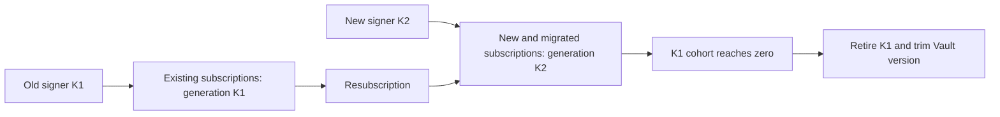

# Rotating the VAPID identity

The VAPID (RFC 8292) P-256 pair is your application's identity to the push services, and replacing
it is not a key rotation in the sense the phrase usually carries. A push subscription is bound to
the `applicationServerKey` it was created with, so a new pair does not take over from the old one —
it starts a second population beside it. This is the runbook for that: what to do, in what order,
what must not happen, and how to tell whether it worked.

[`VAPID.md`](VAPID.md) is how a pair is generated and [`README.md` → VAPID
keys](../README.md#vapid-keys) what its two halves are for. **Only Part one is about Vault**, whose
key versions are where the confusion usually starts; [`VAULT.md`](VAULT.md) is the configuration
reference behind it. Everything from Part two on holds for a locally held pair, a KMS or an HSM
just as it does for Vault Transit — only the mechanics of minting the new key change, and that is
one step out of nine.

## What the protocol requires

All of it follows from one section of RFC 8292. A user agent that is handed an
`applicationServerKey` creates a *restricted* subscription
([§4.1](https://datatracker.ietf.org/doc/html/rfc8292#section-4.1)), and for a restricted
subscription the push service **MUST** reject a delivery whose VAPID authentication is invalid —
where invalid includes the case that matters here, "the public key used to sign the JWT doesn't
match the one that was included in the creation of the push message subscription"
([§4.2](https://datatracker.ietf.org/doc/html/rfc8292#section-4.2)). The same section names the
statuses it expects — "A 401 (Unauthorized) status code might be used if the authentication is
absent; a 403 (Forbidden) status code might be used if authentication is invalid" — and push2u
classifies both as `PushOutcome.NonRetryableFailure`: **not** `SubscriptionExpired`, so nothing
marks the stored row dead, and no retry schedule will ever clear it.

The same section states the remedy, in the RFC's own words:

> An application server that needs to replace its signing key needs to request the creation of a new
> subscription by the user agent that is restricted to the updated key. Application servers need to
> remember the key that was used when requesting the creation of a subscription.

That is the whole of this runbook — a new subscription per client, and a record per subscription of
which key it was created under. The rest is ordering, and the operations that must not happen early.

## Two scenarios that do not share a recipe

|  | Planned migration | Compromised key |
|---|---|---|
| Why you are here | a new key generation, a custodian move, policy | the private half is in someone else's hands |
| The old identity | goes on signing until its cohort is empty | stops signing now |
| The old subscriptions | kept, and migrated as clients return | deleted — they are the attacker's reach too |
| Two senders at once | for as long as the old cohort exists | briefly, for the length of one deploy |
| Resubscription | driven, at the clients' own pace | forced |
| Raising the minimum, trimming | the last step, after the cohort is empty | early, on purpose |
| Cost of getting it wrong | subscribers stop receiving, silently | the attacker keeps a working channel |

**If the private key has leaked, stop here and read [Emergency rotation when the key is
compromised](#emergency-rotation-when-the-key-is-compromised).** Every step between here and there
keeps the old identity alive and signing, which is the last thing you want while someone else is
holding it. And do not run the emergency procedure for housekeeping: it takes the whole subscriber
population off the air and hands you back only those who come back.

## Preconditions

Two, and the migration cannot be run without both.

**1. The subscription store records which identity each subscription was created under.** This is
the RFC's own requirement — "Application servers need to remember the key that was used when
requesting the creation of a subscription" — and nothing else can stand in for it: an endpoint says
nothing about the key it was bound to, and neither does the `p256dh`/`auth` pair, which belongs to
the browser rather than to you. Store a generation label you control, or the base64url public key
itself.

Every row already stored belongs to the identity in use today, so backfilling is a single update.
(A row created before your application passed any `applicationServerKey` is not a restricted
subscription and §4.2's match rule does not bind it — but nothing in the stored row tells you which
kind it is, so treat everything already stored as the old generation.)

**2. The application can hold two senders at once and choose between them per send.** A
`PushSender` is built around one `VapidSigner` and there is no operation that replaces it
afterwards — deliberately, see [Why there is no `refresh()`](#why-there-is-no-refresh). Two
identities is therefore two signers and two senders, alive simultaneously, for as long as the old
cohort exists. Under Spring that is two beans and the starter autoconfigures one: [`SPRING.md` → Two
identities during a key rotation](SPRING.md#two-identities-during-a-key-rotation) has what that
takes.

If either precondition is missing, [When the migration is not possible
yet](#when-the-migration-is-not-possible-yet) is the section to read instead.

## Part one: what a Vault Transit rotation does

**If the key is not in Vault, skip to Part two.** Nothing in this section changes the algorithm
there.

`vault write -f transit/keys/<key>/rotate` creates a new key version, and that is all it does.
HashiCorp: "This endpoint rotates the version of the named key. After rotation, new plaintext
requests will be encrypted with the new version of the key"
([Rotate key](https://developer.hashicorp.com/vault/api-docs/secret/transit#rotate-key)) — a
sentence written about encryption because that is what Transit is mostly used for; for a signing
key what moves is which version *latest* names. No existing version is removed, and no request
naming a version is touched: on the signing endpoint, "Leave `key_version` unset to use the latest
version" ([Sign
data](https://developer.hashicorp.com/vault/api-docs/secret/transit#sign-data)), and push2u's
fetched modes never leave it unset.

What that means for a running deployment depends on which mode built the signer:

- **A running fetched-mode signer is unaffected, and correctly so.** It captured `latest_version`
  and that version's public key from one `transit/keys/<key>` response and sends that `key_version`
  on every sign request, so a newer version accumulating beside it changes nothing it does.
  `latest_version` running ahead of the pinned one is the normal, safe state for a VAPID key — not
  drift, and not something push2u is failing to notice.
- **The next process to start is another matter, and this is the trap.** A fetched-mode signer takes
  `latest_version` *every time one is built*, and the version it took is persisted nowhere. So the
  next restart, redeploy, scale-up or reschedule builds a signer on the new version and advertises
  it — while every stored subscription is still bound to the old one. Nothing was rotated
  deliberately at that moment; a `rotate` run weeks earlier is what armed it. During a rolling
  restart the fleet is split, and the same subscription succeeds on the pods that have not restarted
  yet and fails on the ones that have.
- **The supplied mode with `key-version` set does not move**, on restart or otherwise; it pins the
  version it was configured with. Left unset it sends no `key_version` at all, so Vault signs with
  the latest — after a rotate the signature comes from a version whose public key is not the
  `public-key` you advertise, and the health probe reports `DOWN` because that signature does not
  verify against the advertised key ([`HEALTH.md`](HEALTH.md)). It is the one configuration where a
  rotate breaks loudly, at once, instead of waiting for a restart.

**Before you rotate, pin what you have.** A fetched-mode deployment cannot name two identities,
because its configuration can only say "latest": the old sender's signer survives a rotate in
memory and does not survive the next restart. So the first move of a Vault migration is to read the
current version and its public key (`vault read transit/keys/<key>`) and rebuild the *existing*
sender in the [explicit mode](VAULT.md#explicit-public-key) with that `key-version`. Only then does
rotating become safe, and the new identity is best pinned the same way, so that a second rotate by
someone else moves nothing.

**So "routine rotation for hygiene" is close to meaningless for a Transit key dedicated to VAPID.**
The new version cannot be adopted transparently; adopting it *is* the migration in Part two, and
running that migration is the only thing that makes having rotated worth anything. An operator
rotating on a schedule out of habit is accumulating versions nobody will ever sign with, and is one
unrelated restart — or one `min_available_version` — away from taking their subscribers off the air.

The two operations that destroy the old identity outright, and what each one is:

- **`min_encryption_version`** — "Specifies the minimum version of the key that can be used to
  encrypt plaintext, sign payloads, or generate HMACs" ([Update key
  configuration](https://developer.hashicorp.com/vault/api-docs/secret/transit#update-key-configuration)).
  Raised above the version a signer pinned, Vault refuses every sign request naming it, because
  `key_version` "must be unset or greater than or equal to the associated `min_encryption_version`
  value". push2u reports that as a `PushCryptoException` out of `send` — the type reserved for a
  failure that recurs until a person changes something — so it is thrown rather than returned as an
  outcome a caller could schedule around.
- **`min_available_version`, through the trim endpoint** — "This endpoint trims older key versions
  setting a minimum version for the keyring. Once trimmed, previous versions of the key cannot be
  recovered", and its parameter is "The minimum available version for the key ring. All versions
  before this version will be permanently deleted"
  ([Trim key](https://developer.hashicorp.com/vault/api-docs/secret/transit#trim-key)). It cannot be
  the first destructive step: it "can at most be equal to the lesser of `min_decryption_version` and
  `min_encryption_version`" and "is not allowed to be set when either `min_encryption_version` or
  `min_decryption_version` is set to zero", so raising the minimums comes first — and the raising is
  already what stops the signing. Trimming is what makes it permanent.

`min_decryption_version` is the one that does not stop push2u signing. "For signatures, this value
controls the minimum version of signature that can be verified against" ([Update key
configuration](https://developer.hashicorp.com/vault/api-docs/secret/transit#update-key-configuration)),
and push2u verifies nothing through Vault — the health probe verifies locally, against the key the
signer itself advertises. It matters here only as trimming's other prerequisite.

## Part two: the identity migration

### The shape of it

**The arrows that are not drawn are the point.** Nothing runs from the old signer to the new cohort
or from the new signer to the old one: the two populations are disjoint from the moment K2 exists,
and the only path between them goes through a client subscribing again. That is why the migration
finishes by attrition rather than by a step you can run, and why retiring K1 is gated on a count
rather than on a date.

### The migration step by step

**1. Mint the new key.** In Vault Transit, `vault write -f transit/keys/<key>/rotate` — after the
pinning move in [Part one](#part-one-what-a-vault-transit-rotation-does), never before it. For a
locally held pair, the `jshell` recipe in [`VAPID.md`](VAPID.md), into the secret store *beside* the
old pair rather than over it. For a KMS or an HSM, whatever that custodian calls creating a new key
or key version. The requirement is the same everywhere: a P-256 pair whose public half you can
publish and whose private half a `VapidSigner` can sign with. **The old key is not touched at this
step, nor at any step before 9.**

**2. Build a second signer and a second sender.** A new `VapidSigner` over the new key, a new
`PushSender` around it, both *beside* the existing pair. Nothing about the old sender changes: do
not repoint it, do not rebuild it against the new key, and do not restart the process expecting a
fetched-mode Vault signer to keep its identity through the restart. Both senders take the same
contact address and the same `EndpointPolicy` — those belong to the deployment, not to an identity.

**3. Start creating new subscriptions under the new key.** The frontend gets K2's public key —
`signer.publicKeyBase64Url()` on the new signer, or `VapidKeys.encodePublicKey(...)` for a pair you
hold ([`README.md` → Publishing the public key to the
browser](../README.md#publishing-the-public-key-to-the-browser)) — and every `subscribe(...)` from
now on is restricted to K2. Existing subscriptions are untouched by this: a client that does not
subscribe again stays on K1, and stays working.

**4. Store the generation with every subscription.** At registration, write down which key the
browser was handed. New rows are K2; every row already stored is K1. Store a label whose meaning is
fixed — the point of it is that it still says K1 after K1 has gone from your configuration — and
never a pointer to "the current key".

**5. Route sends by that label.** Old rows through the sender holding the old signer, new rows
through the new one. A send routed to the wrong sender is a `401`/`403`, and nothing in that answer
distinguishes it from a subscription the user revoked, so a routing mistake surfaces as unexplained
delivery loss rather than as an error naming its cause. Make the unknown case loud: a row whose
generation you cannot determine is reported, not sent through whichever sender is nearer to hand.

**6. Drive resubscription of the old cohort.** Nothing moves a subscription between identities — the
push service recorded the key at subscribe time, and that record is not yours to edit. The client
has to drop its old subscription and create a new one with K2, and your registration endpoint writes
the new row and deletes the old. What drives it is the application's own: a service-worker update, a
check at page load comparing the key the subscription was created with against the key the server
now serves, a message asking the user to come back. The pace is the clients', and a subscriber who
never opens the application again never migrates.

**7. Watch the counts.** [Observability](#observability) below is what to count and where each
number comes from. This step runs for as long as step 6 does.

**8. Retire the old sender when its cohort reaches zero.** Zero means no row in the store carries
the old generation — not "no send has used it lately", since a subscription nobody has pushed to for
a month is still a valid subscription. Retiring is: stop building the old signer and sender, and
remove the old key from configuration. Keep the routing branch for the old generation for one
release, answering with a loud error, so that a row you missed is reported rather than sent under
the wrong identity.

**9. Only then make the old key unusable.** In Vault, raise `min_encryption_version` past the
retired version and then trim it with `min_available_version`, in that order, the second
irreversible. For a locally held pair, delete the private half from the secret store. Nothing before
this step removes the ability to sign under the old identity, which is exactly what makes every step
above reversible and this one not.

### Observability

**push2u ships no metrics.** There is no meter registry, no counter and no binder in either starter,
and the health indicator is not one. Every number below is the application's to produce, from data
it already has.

- **Active subscriptions per generation**, from the subscription store. This is the number that
  decides when step 8 may run, and the only one that can. It should fall monotonically for the old
  generation; a plateau means the resubscription drive has stopped reaching people, not that the
  migration is finished.
- **Sends and outcomes per generation**, counted at your own call site. `PushOutcome` is a sealed
  type, so a switch over it where you already know which sender you routed to gives the whole
  classification. Two patterns are worth alerting on. `NonRetryableFailure` appearing on a
  generation that was working is a routing defect — the wrong sender is signing for that cohort —
  and not a user action. `SubscriptionExpired` (`404`/`410`) is the ordinary way the old cohort
  shrinks without anyone resubscribing: delete the row, and the count falls honestly.
- **The custodian's own view.** For Vault, `vault read transit/keys/<key>` and compare
  `latest_version` with the version each sender was built against. That is the check that replaces
  the accessor push2u does not publish (see [Why there is no `refresh()`](#why-there-is-no-refresh))
  — and remember that a gap between the two is the expected state during a migration, not an alert.

**What the health indicator does not tell you.** It asserts that a signer can sign and that the
signature verifies against the key that signer itself advertises, and nothing beyond it
([`HEALTH.md`](HEALTH.md)). It says nothing about which cohort that key serves, and during a
migration the starter registers one indicator over one signer bean — so a green probe is not
evidence that both identities are alive.

### Rollback

**Stop issuing K2 to new subscriptions.** Serve K1's public key again wherever the frontend reads
`applicationServerKey`, and let registrations go back to writing the old generation. That is the
whole of a rollback.

**Do not delete K2, and do not retire its sender.** Every subscription already created under K2 can
be served by K2 and by nothing else: the push service recorded K2's public key at subscribe time and
is obliged to reject a JWT signed under any other. Deleting the key or dropping the sender does not
undo those subscriptions — it strands them, permanently, exactly as a premature trim would.

**Do not move migrated rows back to K1.** The generation label records a fact about the push
service's record, not a preference of yours. Rewriting `k2` to `k1` on a row makes every send for it
fail, and nothing short of that client subscribing again can repair it.

So a rollback narrows K2's growth and takes nothing back. The state it leaves — two cohorts, each
served by its own sender — is the state the migration was in anyway, which is precisely why a
migration run this way is cheap to abandon: at no point did it remove anything.

### Forbidden actions

- **A `refresh()` on a live signer.** push2u publishes none, for the reasons
  [below](#why-there-is-no-refresh). A custom `VapidSigner` that swaps its own key does not adopt a
  new identity — it invalidates, at one stroke, every subscription the sender around it was serving,
  and it can emit a header whose signature and whose `k` come from different keys.
- **An automatic refresh interval, a TTL on a fetched key, or a background poller.** The same swap
  with its trigger hidden in a duration, so the outage arrives at a moment nobody chose and
  correlates with nothing anybody deployed.
- **Switching a single sender to the new key.** Editing the configured key pair in place, or
  restarting a fetched-mode Vault deployment after a rotate, replaces the identity for the whole
  fleet in one deploy. Every stored subscription then fails with `401`/`403` — `NonRetryableFailure`
  and never `SubscriptionExpired`, so nothing prunes the rows and no retry clears them — and the
  only recovery is every subscriber coming back to subscribe again.
- **Trimming the old version, or raising the minimum, before the old cohort is gone.** Raising
  `min_encryption_version` above the pinned version ends the old signer's ability to sign at all:
  every send through it fails with a `PushCryptoException`, which is thrown rather than returned.
  Trimming deletes the version outright — "Once trimmed, previous versions of the key cannot be
  recovered".
- **Assuming a restart performs the migration.** It changes what the process advertises, never what
  the push service recorded. In the Vault fetched mode it is how the trap in Part one springs; in
  every mode it is a way of doing step 3 to the entire population without doing steps 4, 5 or 6.

## Emergency rotation when the key is compromised

**First establish what actually leaked, because the answer decides whether you lose your subscriber
base.**

- **The private key itself** — an exported scalar, a secret store someone read, a backup that
  travelled. Whoever holds it can send to every subscription of that cohort and the push service
  cannot tell them from you. The identity is finished.
- **Access to a custodian that never released the key.** A Vault Transit key is not exportable
  unless someone enabled it: `exportable` defaults to false, and "Enables keys to be exportable…
  Once set, this cannot be disabled"
  ([Create key](https://developer.hashicorp.com/vault/api-docs/secret/transit#create-key)). So a
  leaked Vault token, or a network path to Vault that should not have existed, is a compromise of
  *access* rather than of key material. Revoking the token and closing the path can be the whole
  fix, with the VAPID identity intact and not one subscriber lost.

If the key material itself is gone, the economics invert: losing the old cohort is the objective
rather than the cost, and the moves the planned migration forbids are the correct ones.

**1. Mint the new identity somewhere the compromise did not reach** — a new Transit key rather than
a new version of the compromised one if the custodian or its credentials are themselves in question,
or a fresh pair generated on a clean host.

**2. Switch every sender to it at once.** No cohort routing, no two-sender period beyond the length
of the deploy. This is precisely the "switching a single sender to the new key" the planned recipe
forbids, and here it is right.

**3. Stop the old key signing, immediately.** In Vault, raise `min_encryption_version` above the
compromised version; trim it with `min_available_version` once you are certain, remembering that
trimming needs both minimums raised first ([Part
one](#part-one-what-a-vault-transit-rotation-does)) and cannot be undone. For a local pair, destroy
the private half everywhere it is stored. Be clear
about what this does and does not achieve: it stops *your* infrastructure from using the key. It
does nothing to an attacker holding the scalar, because the push services will keep honouring it
until each subscription is replaced — which is why step 4 is urgent rather than tidy.

**4. Delete the old subscriptions and force resubscription.** Each row you keep is a client someone
else can push to. Delete them, and have every client subscribe again under the new key at its next
visit.

**5. Accept the loss.** Subscribers who do not come back do not migrate. No operation in this
library or in the protocol moves a subscription from one application-server key to another.

**Do not run the planned migration for a compromise.** Every one of its steps keeps the old identity
alive and serving, which is exactly what an attacker holding the key needs from you.

## When the migration is not possible yet

If the subscription store does not record which identity each row was created under, there is no
safe gradual rotation, and no ordering of the steps above produces one. The store changes first: add
the column, backfill every existing row with the identity in use today, deploy that, and start the
migration afterwards. Until then the honest answer to "can we rotate?" is no.

Two things that look like a way around it are not.

- **Rotating and letting the failures tell you which rows moved.** A key mismatch is a `401` or a
  `403`, which push2u classifies as `NonRetryableFailure`. It is not a `404`/`410`, so nothing marks
  the row dead and no cleanup removes it; the failure mode is every subscriber silently stopping
  while the store still reports them healthy.
- **Trying one sender and falling back to the other.** A `403` does not distinguish "wrong identity"
  from "this subscription is refused for some other reason", so the fallback cannot be made
  reliable — and every send in the migration window becomes two real POSTs to a push service, which
  counts them. push2u performs exactly one POST per `send` on purpose; the second attempt is one the
  caller writes and owns.

Adding the column is smaller than either of them.

## Why there is no `refresh()`

Two independent reasons, and the first alone would be enough.

**The protocol makes a hot swap something other than a rotation.**
[RFC 8292 §4.2](https://datatracker.ietf.org/doc/html/rfc8292#section-4.2) obliges a push service to
reject a delivery whose JWT key is not the one the subscription was created with, so replacing the
advertised key under a live sender does not adopt a new key. It invalidates a cohort. The operation
an operator wants is the migration above, and it stays a migration whatever holds the key: no
library API can make the push services forget what they recorded.

**The SPI cannot express the swap safely.** A VAPID header is built from two calls on `VapidSigner`
— `sign` first, then `publicKey`. A refresh landing between them yields a header carrying a
signature made under one key beside the other key's `k`: internally contradictory, and detectable
only at the push service, which answers `401`/`403` with nothing pointing back at the cause. A
signer that swaps its key under a live sender is a signer breaking the contract the interface
states, and shipping `refresh()` would make push2u's own Vault signer that violator in its normal
mode of operation.

For the same reason there is no `keyVersion()` accessor. It would answer what this process pinned
rather than what the custodian now holds, so it would detect a pending rotation only for a caller
already reading the custodian — and a `latest_version` ahead of the pinned one is the normal, safe
state for a VAPID key rather than a fault to alert on. The check that means something is the one
against Vault, in [Observability](#observability) above.
