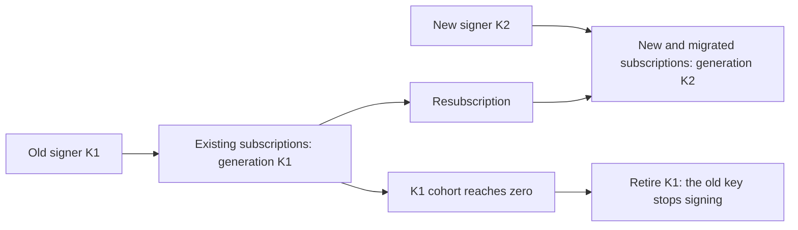

# Rotating the VAPID identity

The VAPID (RFC 8292) P-256 pair is your application's identity to the push services, and replacing
it is not a key rotation in the sense the phrase usually carries. A push subscription is bound to
the `applicationServerKey` it was created with, so a new pair does not take over from the old one —
it starts a second population beside it. This is the runbook for that: what to do, in what order,
what must not happen, and how to tell whether it worked.

[`VAPID.md`](VAPID.md) is how a pair is generated and [`README.md` → VAPID
keys](../README.md#vapid-keys) what its two halves are for. **Only Part one is about Vault**, whose
key versions are where the confusion usually starts; [`VAULT.md`](VAULT.md) is the configuration
reference behind it. Everything from Part two on holds for a locally held pair, a KMS or an HSM
just as it does for Vault Transit — only the mechanics of minting the new key change, and that is
one step out of nine.

## What the protocol requires

All of it follows from one section of RFC 8292. A user agent that is handed an
`applicationServerKey` creates a *restricted* subscription
([§4.1](https://datatracker.ietf.org/doc/html/rfc8292#section-4.1)), and for a restricted
subscription the push service **MUST** reject a delivery whose VAPID authentication is invalid —
where invalid includes the case that matters here, "the public key used to sign the JWT doesn't
match the one that was included in the creation of the push message subscription"
([§4.2](https://datatracker.ietf.org/doc/html/rfc8292#section-4.2)). The same section names the
statuses it expects — "A 401 (Unauthorized) status code might be used if the authentication is
absent; a 403 (Forbidden) status code might be used if authentication is invalid" — and push2u
classifies both as `PushOutcome.NonRetryableFailure`: **not** `SubscriptionExpired`, so nothing
marks the stored row dead, and no retry schedule will ever clear it.

The same section states the remedy, in the RFC's own words:

> An application server that needs to replace its signing key needs to request the creation of a new
> subscription by the user agent that is restricted to the updated key. Application servers need to
> remember the key that was used when requesting the creation of a subscription.

That is the whole of this runbook — a new subscription per client, and a record per subscription of
which key it was created under. The rest is ordering, and the operations that must not happen early.

## Two scenarios that do not share a recipe

|  | Planned migration | Compromised key |
|---|---|---|
| Why you are here | a new key generation, a custodian move, policy | the private half is in someone else's hands |
| The old identity | goes on signing until its cohort is empty | stops signing now |
| The old subscriptions | kept, and migrated as clients return | deleted — they are the attacker's reach too |
| Two senders at once | for as long as the old cohort exists | briefly, for the length of one deploy |
| Resubscription | driven, at the clients' own pace | forced |
| Ending the old key's use | raise the minimum, once the cohort is empty; trim only if a retention policy asks | early, on purpose — but see step 3 for what Vault will actually accept |
| Cost of getting it wrong | subscribers stop receiving, silently | the attacker keeps a working channel |

**If the private key has leaked, stop here and read [Emergency rotation when the key is
compromised](#emergency-rotation-when-the-key-is-compromised).** Every step between here and there
keeps the old identity alive and signing, which is the last thing you want while someone else is
holding it. And do not run the emergency procedure for housekeeping: it takes the whole subscriber
population off the air and hands you back only those who come back.

## Preconditions

Two, and the migration cannot be run without both.

**1. The subscription store records which identity each subscription was created under.** This is
the RFC's own requirement — "Application servers need to remember the key that was used when
requesting the creation of a subscription" — and nothing else can stand in for it: an endpoint says
nothing about the key it was bound to, and neither does the `p256dh`/`auth` pair, which belongs to
the browser rather than to you. Store a generation label you control, or the base64url public key
itself.

Every row already stored belongs to the identity in use today, so backfilling is a single update.
(A row created before your application passed any `applicationServerKey` is not a restricted
subscription and §4.2's match rule does not bind it — but nothing in the stored row tells you which
kind it is, so treat everything already stored as the old generation.)

**2. The application can hold two senders at once and choose between them per send.** A
`PushSender` is built around one `VapidSigner` and there is no operation that replaces it
afterwards — deliberately, see [Why there is no `refresh()`](#why-there-is-no-refresh). Two
identities is therefore two signers and two senders, alive simultaneously, for as long as the old
cohort exists. Under Spring that is two beans and the starter autoconfigures one: [`SPRING.md` → Two
identities during a key rotation](SPRING.md#two-identities-during-a-key-rotation) has what that
takes.

**Both of those are about your application. One more thing is about the key itself: find out whether
anything rotates it without you.** Every safety instruction below begins "before you rotate", and
that assumes a person runs the rotation. Vault Transit ships a per-key scheduler that does not:
`auto_rotate_period`, "the period at which this key should be rotated automatically", where `"0"` is
the default and disables it and the shortest accepted period is one hour
([Create key](https://developer.hashicorp.com/vault/api-docs/secret/transit#create-key)). It can
also be set after the fact on the key's config endpoint, whose values "are returned during a read
operation on the named key" ([Update key
configuration](https://developer.hashicorp.com/vault/api-docs/secret/transit#update-key-configuration)),
so `vault read transit/keys/<key>` is where you check it. A platform team's blanket policy setting
it on every Transit key is enough to catch you: months later an unrelated deploy restarts the fleet
onto a version nobody created by hand, and "pin before you rotate" never fired because nobody
rotated. **If the key is scheduled, clear the period for the duration of the migration.** Leaving it
and relying on the pinning move instead is not an equal choice: that move cannot protect the window
in which it is itself being rolled out. Its check runs before the rollout starts, and un-migrated
fetched-mode processes are still running behind it — so a timer firing mid-rollout is adopted by any
of them that restarts for one of the ordinary reasons, with the check already passed.

If either precondition is missing, [When the migration is not possible
yet](#when-the-migration-is-not-possible-yet) is the section to read instead.

## Part one: what a Vault Transit rotation does

**If the key is not in Vault, skip to Part two.** Nothing in this section changes the algorithm
there.

`vault write -f transit/keys/<key>/rotate` creates a new key version, and that is all it does.
HashiCorp: "This endpoint rotates the version of the named key. After rotation, new plaintext
requests will be encrypted with the new version of the key"
([Rotate key](https://developer.hashicorp.com/vault/api-docs/secret/transit#rotate-key)) — a
sentence written about encryption because that is what Transit is mostly used for; for a signing
key what moves is which version *latest* names. No existing version is removed, and no request
naming a version is touched: on the signing endpoint, "Leave `key_version` unset to use the latest
version" ([Sign
data](https://developer.hashicorp.com/vault/api-docs/secret/transit#sign-data)), and push2u's
fetched modes never leave it unset.

What that means for a running deployment depends on which mode built the signer, on whether a
version was pinned, and — for one mode — on whether the signer has been used yet. Five states, and
exactly one of them — a supplied `key-version` — is beyond a rotate's reach:

- **An eager fetched-mode signer that is running is unaffected, and correctly so.** It captured
  `latest_version` and that version's public key from one `transit/keys/<key>` response inside
  `build()`, and sends that `key_version` on every sign request, so a newer version accumulating
  beside it changes nothing it does. `latest_version` running ahead of the pinned one is the normal,
  safe state for a VAPID key — not drift, and not something push2u is failing to notice.
- **A deferred fetched-mode signer that has not been used yet has captured nothing, and this is the
  trap that needs no restart.** With `public-key-fetch: deferred` the read happens on the first
  `sign`, `publicKey` or `publicKeyBase64Url` call, so a process that has not sent, and whose key
  nothing has asked for, is pinned to no version at all. Rotate while it is in that state and the
  first send — whenever it comes — initializes the whole fleet on the *new* version, with no restart
  and no deploy anywhere near it. The deployment most likely to be sitting in exactly that state is
  the one this mode was built for: push as a secondary channel, and a container check pointed at a
  health group that excludes push2u, which is the routing
  [`HEALTH.md`](HEALTH.md#keeping-the-probe-out-of-a-container-health-check) recommends here — so
  nothing probes the signer and nothing initializes it. Once it *has* initialized, it behaves
  exactly like the eager one above and is equally safe.
- **The next process to start is a trap for both fetched modes.** A fetched-mode signer takes
  `latest_version` from the read it performs — at `build()` in the eager mode, at first use in the
  deferred one — and never persists it. So the next restart, redeploy, scale-up or reschedule reads
  afresh, lands on the new version and advertises it — while every stored subscription is still
  bound to the old one. Nothing was rotated deliberately at that moment; a `rotate` run weeks earlier
  is what armed it. During a rolling restart the fleet is split, and the same subscription succeeds
  on the pods that have not restarted yet and fails on the ones that have.
- **The supplied mode with `key-version` set does not move**, on restart or otherwise. It pins the
  version it was configured with, and push2u additionally checks the version in the signature
  envelope Vault returns against that pin, raising a `PushCryptoException` on a mismatch — so a
  signature from another version fails in your own process rather than as an opaque push-service
  rejection. This is the state the pinning move below puts you in, and the only one a rotate cannot
  reach. Note what that check does *not* cover: it compares the envelope against the pin, not the
  advertised key against either, so a pin that names the wrong version for the key beside it passes
  it. That is what the pinning move's own check is for.
- **The supplied mode with `key-version` left out is the state to get out of.** No `key_version` is
  sent, so Vault signs with the latest — and after a rotate that is a version whose public key is not
  the `public-key` you advertise. **The envelope check does not fire here**: it is guarded on there
  being a pin to compare against, so with none the returned version is accepted whatever it says.
  Sends therefore do not fail loudly; they fail at the push service as `401`/`403`, the same silent
  shape as the fetched-mode traps above. The only local signal is the health indicator, which
  verifies a signature against the advertised key and so reports `DOWN` — but that needs Actuator on
  the classpath, needs not to have been switched off by its own property, needs something to
  evaluate it, caches its verdict, and is the contributor this very document routes out of the
  container check. Even the onset lags: the VAPID token cache is keyed on the advertised key, which
  does *not* move in this state, so tokens minted before the rotate go on being served until they
  expire ([`HEALTH.md`](HEALTH.md) has what the probe does and does not assert).

**Before you rotate, pin what you have.** A fetched-mode deployment cannot name two identities,
because its configuration can only say "latest". An eager signer that is already running survives a
rotate in memory but not the next restart; a deferred one that has not been used yet survives
nothing, since it has not read a version to keep. So the first move of a Vault migration is to move
the *existing* sender to the [explicit mode](VAULT.md#explicit-public-key), pinning what it is
serving today:

- **the version** from `vault read transit/keys/<key>` — its `latest_version`, which is what a
  fetched signer would take;
- **the public key** from the running signer itself, `signer.publicKeyBase64Url()`. Take it there
  and not from `vault read`, whose `public_key` is a PEM: `push2u.signer.vault.public-key` wants the
  unpadded base64url of the 65-byte uncompressed point, nothing in this project converts between the
  two, and `publicKeyBase64Url()` already returns exactly that — the same string your frontend is
  being served as `applicationServerKey`, which is also the identifier this whole migration routes
  on. On a *deferred* signer that has not been used yet, asking for it **is** the first use and
  performs the read — harmless where nothing has rotated, since it pins what any first send would
  have pinned, and the check below is what tells you whether that is the case.

**Those two halves come from different places, so check that they agree before you deploy them.**
The version comes from Vault and the key from your own process, and they describe one identity only
if nothing has created a version since your processes last started. `vault read` is where you
establish that: its `keys` object "shows the creation time of each key version"
([Read key](https://developer.hashicorp.com/vault/api-docs/secret/transit#read-key)), so compare
those against the start time of your oldest running process. **This is the only evidence there is**,
because nothing publishes what a running signer pinned — the same deliberate absence as
[Why there is no `refresh()`](#why-there-is-no-refresh) — and no check anywhere establishes that a
supplied `public-key` belongs to the supplied `key-version`: not Vault's, and not push2u's.

If a version is newer than your oldest process, **stop**. `latest_version` is not what the fleet is
serving, so the pair you were about to pin would advertise one version's key beside another
version's signature, and the one local guard would not catch it: push2u compares the signature
envelope's version against the *pinned* number, and those two would agree. Every push service would
reject; nothing in your logs would. That is
[When the migration is not possible yet](#when-the-migration-is-not-possible-yet).

**That rollout has to be finished before the rotate, everywhere.** One fetched-mode process left
running is one process that will adopt the new version the moment anything restarts it — an
autoscaler, a crash loop, a node drain — and by the paragraph above that is enough to split the
fleet across two identities. No fetched-mode process may remain when the rotate runs. Pin the new
identity the same way once it exists — reading `latest_version` back after your own rotate and
confirming it is the version that rotate created, since the same check applies in a shorter window —
so that a later rotate by someone else moves nothing either.

**So "routine rotation for hygiene" is close to meaningless for a Transit key dedicated to VAPID.**
The new version cannot be adopted transparently; adopting it *is* the migration in Part two, and
running that migration is the only thing that makes having rotated worth anything. An operator
rotating on a schedule out of habit is accumulating versions nobody will ever sign with, and is one
unrelated restart — or one deferred signer's first send — away from taking their subscribers off the
air.

The two operations that destroy the old identity outright, and what each one is:

- **`min_encryption_version`** — "Specifies the minimum version of the key that can be used to
  encrypt plaintext, sign payloads, or generate HMACs" ([Update key
  configuration](https://developer.hashicorp.com/vault/api-docs/secret/transit#update-key-configuration)).
  Raised above the version a signer pinned, Vault refuses every sign request naming it, because
  `key_version` "must be unset or greater than or equal to the associated `min_encryption_version`
  value". push2u reports that as a `PushCryptoException` out of `send` — the type reserved for a
  failure that recurs until a person changes something — so it is thrown rather than returned as an
  outcome a caller could schedule around.
- **`min_available_version`, through the trim endpoint** — "This endpoint trims older key versions
  setting a minimum version for the keyring. Once trimmed, previous versions of the key cannot be
  recovered", and its parameter is "The minimum available version for the key ring. All versions
  before this version will be permanently deleted"
  ([Trim key](https://developer.hashicorp.com/vault/api-docs/secret/transit#trim-key)). It cannot be
  the first destructive step: it "can at most be equal to the lesser of `min_decryption_version` and
  `min_encryption_version`" and "is not allowed to be set when either `min_encryption_version` or
  `min_decryption_version` is set to zero", so raising the minimums comes first — and the raising is
  already what stops the signing. Trimming is what makes it permanent.

`min_decryption_version` is the one that does not stop push2u signing. "For signatures, this value
controls the minimum version of signature that can be verified against" ([Update key
configuration](https://developer.hashicorp.com/vault/api-docs/secret/transit#update-key-configuration)),
and push2u verifies nothing through Vault — the health probe verifies locally, against the key the
signer itself advertises. It matters here only as trimming's other prerequisite.

## Part two: the identity migration

### The shape of it



**The arrows that are not drawn are the point.** Nothing runs from the old signer to the new cohort
or from the new signer to the old one: the two populations are disjoint from the moment K2 exists,
and the only path between them goes through a client subscribing again. That is why the migration
finishes by attrition rather than by a step you can run, and why retiring K1 is gated on a count
rather than on a date.

### The migration step by step

**1. Mint the new key.** In Vault Transit, `vault write -f transit/keys/<key>/rotate` — after the
pinning move in [Part one](#part-one-what-a-vault-transit-rotation-does), never before it. For a
locally held pair, the `jshell` recipe in [`VAPID.md`](VAPID.md), into the secret store *beside* the
old pair rather than over it. For a KMS or an HSM, whatever that custodian calls creating a new key
or key version. The requirement is the same everywhere: a P-256 pair whose public half you can
publish and whose private half a `VapidSigner` can sign with. **The old key is not touched at this
step, nor at any step before 9.**

**2. Build a second signer and a second sender.** A new `VapidSigner` over the new key, a new
`PushSender` around it, both *beside* the existing pair. Nothing about the old sender changes: do
not repoint it, do not rebuild it against the new key, and do not restart the process expecting a
fetched-mode Vault signer to keep its identity through the restart. Both senders take the same
contact address and the same `EndpointPolicy` — those belong to the deployment, not to an identity.

**3. Start creating new subscriptions under the new key.** The frontend gets K2's public key —
`signer.publicKeyBase64Url()` on the new signer, or `VapidKeys.encodePublicKey(...)` for a pair you
hold ([`README.md` → Publishing the public key to the
browser](../README.md#publishing-the-public-key-to-the-browser)) — and every `subscribe(...)` from
now on is restricted to K2. Existing subscriptions are untouched by this: a client that does not
subscribe again stays on K1, and stays working.

**4. Store the generation with every subscription.** At registration, write down which key the
browser was handed. New rows are K2; every row already stored is K1. Store a label whose meaning is
fixed — the point of it is that it still says K1 after K1 has gone from your configuration — and
never a pointer to "the current key".

**Derive that label from the key the browser actually got, not from a second source that says which
generation is current.** Three second sources are within reach, and the third is the one this
migration itself puts there:

- **a flag in configuration** — a different source from the signer the frontend was served out of,
  and the two can be deployed apart or roll out at different speeds;
- **a constant in the registration handler** — the same distance from the serve, now frozen into
  code that ships on a schedule of its own;
- **reading the live signer inside the registration handler.** This is the one a Spring deployment
  reaches for first, and precondition 2 has just made it wrong: two `VapidSigner` beans with one
  marked `@Primary` means an injected `VapidSigner` answers with the primary whatever key the
  browser in front of you was handed. It is a second observation, separated from the serve by
  however long the user took to decide, plus any deploy in between.

The timing is ordinary rather than adversarial. K2 deploys at 10:00 and step 3 flips the frontend;
a user who loaded the page at 09:58 was served K1's key, allows notifications at 10:01, and their
browser creates a subscription restricted to **K1** — while the handler reads the primary signer and
writes `k2`. Step 5 then routes that row to the K2 sender for the rest of its life.

**A row mislabelled this way is invisible to the count that authorises retirement.** The
per-generation counts in [Observability](#observability) are computed from this same label, so the
row counts against K2 and never against K1; step 8 sees no row carrying the old generation and
authorises retirement, and step 9 ends K1's ability to sign while that subscription is still live
and still bound to it. **Invisible to that count is not undetectable**, and the difference is worth
holding on to: every send to that row goes out under the wrong identity and comes back `401`/`403`,
which is exactly the `NonRetryableFailure`-on-a-working-generation signal
[Observability](#observability) tells you to alert on. It fires from the moment the row is created,
long before the gate is read. Watch it, because the gate cannot.

**The single observation is the client's, and it has exactly one source.** The browser can report
the key its own subscription was created with — `PushSubscriptionOptions.applicationServerKey`,
reachable as `subscription.options.applicationServerKey` ([Push
API](https://www.w3.org/TR/push-api/#dom-pushsubscriptionoptions-applicationserverkey)). **The label
comes from that value and from nothing else: not from the key you are currently publishing, not from
the argument passed to `subscribe(...)`, not from configuration, and not from an injected signer.**
The last two are the second sources above; the first two are the same mistake made on the client,
and all four read as correct in review, because the right value is usually in scope beside them.

Two properties of that value decide whether a client can carry it across at all.

**It does not survive `JSON.stringify(subscription)`, and not because it encodes badly.** `toJSON()`
produces a `PushSubscriptionJSON` of `endpoint`, `expirationTime` and `keys`, and the Push API says
the rest in as many words: "Note that the options to a `PushSubscription` are not serialized" ([Push
API](https://www.w3.org/TR/push-api/#pushsubscription-interface)). So the most natural registration
payload there is does not carry the field **at all** — a server reading it finds it absent rather
than empty, a branch written for the missing case fires on every registration, and a `?? current`
fallback labels the whole population with whatever is current, which is the failure this step exists
to prevent. (Handing the `ArrayBuffer` itself to `JSON.stringify` produces `{}`, which is the same
silence reached by a different road.) Put the key in the payload explicitly, beside the serialized
subscription:

```js
const subscription = await registration.pushManager.getSubscription();
const key = subscription?.options.applicationServerKey;

if (!subscription || key === null) {
  throw new Error("Restricted push subscription required");
}

const payload = {
  ...subscription.toJSON(),
  vapidPublicKey: toBase64Url(new Uint8Array(key)),
};
```

`toBase64Url` is your own — unpadded base64url in the URL-safe alphabet, the encoding the rest of
this document means by the word. What matters more than the encoding is where `key` comes from: the
subscription object the browser handed you, never the response of a `GET /vapid-key`-style endpoint.
Those are two different observations, and only the first is about *this* subscription.

**And it is nullable.** A subscription created without an application server key is not restricted
at all, so there is no generation to record — the check above refuses one at the client, and the
server refuses it again rather than labelling it with whatever is current.

**Check the reported key against the keys you actually serve.** The registration endpoint is public,
so what arrives there is a client's assertion about its own subscription and not an observation of
yours. Compare it against the exact set of identities registration may currently produce — during
the migration, K1 and K2, and nothing else — and map a match to a stable server-side generation,
`K1` or `K2`, rather than storing whatever string the client sent. Missing, `null`, malformed and
unknown are one case with one answer: reject the registration, or flag the row for a person. Never
`reportedKey ?? currentKey`; that one `??` is the population-wide mislabelling above, written on
purpose.

**That check is necessary and it is not full validation.** It takes arbitrary labels, and any
fallback to "current", off the table. What it cannot do is establish that the endpoint in the same
body was really created under the key being claimed: the push service holds that binding, publishes
no interface for asking about it, and the only place a mismatch becomes visible is a send — where
the service is obliged to reject a JWT whose public key is not the one included in the creation of
the subscription, answering `401` or `403`
([§4.2](https://datatracker.ietf.org/doc/html/rfc8292#section-4.2)). A client reporting K1 for a K2
subscription, or the reverse, is therefore still making an assertion, and one you learn about at
send time. The blast radius is normally that client's own rows — it misroutes its own deliveries and
nobody else's — and the cost lands on the gate: a row claiming a generation it does not have holds
that cohort's count above zero and delays retirement. So a plateau that
[Observability](#observability) tells you to read as a resubscription drive that has stopped
reaching people can also be a few rows asserting a generation they were never created under.
Investigate one, with the `NonRetryableFailure` counter beside it; do not build anything that
relabels rows automatically to make the count move.

The same rule as the pinning move in Part one, in a different place: an identity and the thing it
belongs to are one observation, or they are a guess.

**5. Route sends by that label.** Old rows through the sender holding the old signer, new rows
through the new one. A send routed to the wrong sender is a `401`/`403`, and nothing in that answer
distinguishes it from a subscription the user revoked, so a routing mistake surfaces as unexplained
delivery loss rather than as an error naming its cause. Make the unknown case loud: a row whose
generation you cannot determine is reported, not sent through whichever sender is nearer to hand.

**6. Drive resubscription of the old cohort.** Nothing moves a subscription between identities — the
push service recorded the key at subscribe time, and that record is not yours to edit. The client
has to drop its old subscription and create a new one with K2, and your registration endpoint writes
the new row and deletes the old. What drives it is the application's own: a service-worker update, a
check at page load comparing the key the subscription was created with against the key the server
now serves, a message asking the user to come back. The pace is the clients', and a subscriber who
never opens the application again never migrates.

**That page-load check holds both keys at once, and only one of them may reach the POST.** The key
just fetched from the server is the *comparison target* and nothing else; the label on any
registration the check sends is `existingSubscription.options.applicationServerKey`, the key that
subscription was actually created under. Post the fetched one instead and every returning visitor
still on K1 relabels their own row as K2 — silently, on a page load, with no resubscription having
happened. That drains the old count to zero across the whole returning population within days, step
8 then reads a gate that says the cohort is empty, and step 9 ends K1's signing under live
subscriptions still bound to it. Step 8's safety net does not catch it either: the loud error it
keeps for one release fires on the old generation, and these rows no longer carry it.

**7. Watch the counts.** [Observability](#observability) below is what to count and where each
number comes from. This step runs for as long as step 6 does.

**8. Retire the old sender when its cohort reaches zero.** Zero means no row in the store carries
the old generation — not "no send has used it lately", since a subscription nobody has pushed to for
a month is still a valid subscription. Retiring is: stop building the old signer and sender, and
remove the old key from configuration. Keep the routing branch for the old generation for one
release, answering with a loud error, so that a row you missed is reported rather than sent under
the wrong identity.

**9. Only then make the old key unusable.** In Vault, raise `min_encryption_version` to the version
the new identity uses — which is legal because it is now the latest — and that alone ends the old
signer's ability to sign: Vault refuses every sign request naming a version below it, and push2u
reports the refusal as a `PushCryptoException` out of `send`. That is the whole of retiring the old
identity. For a locally held pair, the same move is deleting its private half from the secret store.
Nothing before this step removes the ability to sign under the old identity, which is exactly what
makes every step above cheap to abandon and this one the end of the migration.

**Trimming is a separate step, and nothing in this migration asks for it.** `min_available_version`
deletes the old versions outright — "Once trimmed, previous versions of the key cannot be recovered"
— and the raise above has already ended their use, so the trim buys the migration nothing and cannot
be taken back. Run it only where a retention policy requires the material itself to be gone, and
then know two things about the mechanics. It needs **both** minimums raised: `min_available_version`
is capped at the lesser of `min_decryption_version` and `min_encryption_version`, and
`min_decryption_version` starts at `1` on every key. The parameter documentation reads `(int: 0)`,
which is the default of the *request field* rather than the value a created key carries: Vault sets
it on creation, "with new key creations min decryption version is set to 1 rather than the int
default of 0, since keys start at 1"
([`policy.go`](https://github.com/hashicorp/vault/blob/6a77206f1cc1b6cdb29a06fd0fb9c0e154083573/sdk/helper/keysutil/policy.go)).
So raising only the encryption side leaves the cap at `1` and the trim is refused.

### Optional: a K2-only registration phase

**This is a reinforcement and not part of the procedure above.** The nine steps stand as written and
keep their numbering; what follows protects their final phase, at the price of a visibly longer
runbook and one more state the registration endpoint can be in. It is worth taking where "no row
carries K1" and "no client is still holding K1" are different claims — a large population, tabs left
open for days, clients that go weeks between visits.

Through the migration the registration endpoint accepts both identities: K2 for everything new, and
K1 because a client legitimately re-registers a subscription it created months ago. Before
retirement, close it — registration accepts K2 only, and a POST reporting K1 is answered with an
explicit `migration required` rather than a stored row. A client receiving that drops its
subscription and creates a new one under K2, which is the move step 6 was driving anyway, now
demanded at the one moment a fresh K1 row would otherwise be created behind the gate. Then wait: an
observation window in which no new K1 registration arrives is evidence step 8's count cannot give
you, because a count of what exists says nothing about what is still on its way — a tab open since
before step 3, a service worker that never updated, a device that was offline for a week.

### Observability

**push2u ships no metrics.** There is no meter registry, no counter and no binder in either starter,
and the health indicator is not one. Every number below is the application's to produce, from data
it already has.

- **Active subscriptions per generation**, from the subscription store. This is the number that
  decides when step 8 may run, and the only one that can. It should fall monotonically for the old
  generation; a plateau usually means the resubscription drive has stopped reaching people, and
  never that the migration is finished — step 4 has the other reading, a row asserting a generation
  it was never created under.
- **Sends and outcomes per generation**, counted at your own call site. `PushOutcome` is a sealed
  type, so a switch over it where you already know which sender you routed to gives the whole
  classification. Two patterns are worth alerting on. `NonRetryableFailure` appearing on a
  generation that was working is a routing or labelling defect — the wrong sender is signing for
  that cohort — and not a user action. `SubscriptionExpired` (`404`/`410`) is the ordinary way the
  old cohort shrinks without anyone resubscribing: delete the row, and the count falls honestly.
- **The custodian's own view.** For Vault, `vault read transit/keys/<key>` and compare
  `latest_version` with the version each sender was built against. That is the check that replaces
  the accessor push2u does not publish (see [Why there is no `refresh()`](#why-there-is-no-refresh))
  — and remember that a gap between the two is the expected state during a migration, not an alert.
  **It is only performable once that version is in your own configuration**, because nothing exposes
  what a running signer pinned: in a fetched mode there is no second number to compare against, so
  this check begins working at the pinning move and not before — one more reason that move comes
  first. The same read is where `auto_rotate_period` shows up, so a scheduler somebody set on the
  key is visible in the answer you are already looking at.

**What the health indicator does not tell you.** It asserts that a signer can sign and that the
signature verifies against the key that signer itself advertises, and nothing beyond it
([`HEALTH.md`](HEALTH.md)). It says nothing about which cohort that key serves, and during a
migration the starter registers one indicator over one signer bean — so a green probe is not
evidence that both identities are alive.

### Rollback

**Stop issuing K2 to new subscriptions.** Serve K1's public key again wherever the frontend reads
`applicationServerKey`, and let registrations go back to writing the old generation. That is the
whole of a rollback.

**Do not delete K2, and do not retire its sender.** Every subscription already created under K2 can
be served by K2 and by nothing else: the push service recorded K2's public key at subscribe time and
is obliged to reject a JWT signed under any other. Deleting the key or dropping the sender does not
undo those subscriptions — it strands them, permanently, exactly as retiring an identity whose
cohort still had rows in it would.

**Do not move migrated rows back to K1.** The generation label records a fact about the push
service's record, not a preference of yours. Rewriting `k2` to `k1` on a row makes every send for it
fail, and nothing short of that client subscribing again can repair it.

So a rollback narrows K2's growth and takes nothing back. The state it leaves — two cohorts, each
served by its own sender — is the state the migration was in anyway, which is precisely why a
migration run this way is cheap to abandon: at no point did it remove anything.

### Forbidden actions

- **A `refresh()` on a live signer.** push2u publishes none, for the reasons
  [below](#why-there-is-no-refresh). A custom `VapidSigner` that swaps its own key does not adopt a
  new identity — it invalidates, at one stroke, every subscription the sender around it was serving,
  and it can emit a header whose signature and whose `k` come from different keys.
- **An automatic refresh interval, a TTL on a fetched key, or a background poller.** The same swap
  with its trigger hidden in a duration, so the outage arrives at a moment nobody chose and
  correlates with nothing anybody deployed.
- **Switching a single sender to the new key.** Editing the configured key pair in place, or
  restarting a fetched-mode Vault deployment after a rotate, replaces the identity for the whole
  fleet in one deploy. Every stored subscription then fails with `401`/`403` — `NonRetryableFailure`
  and never `SubscriptionExpired`, so nothing prunes the rows and no retry clears them — and the
  only recovery is every subscriber coming back to subscribe again.
- **Raising the minimum, or trimming the old version, before the old cohort is gone.** Raising
  `min_encryption_version` above the pinned version ends the old signer's ability to sign at all:
  every send through it fails with a `PushCryptoException`, which is thrown rather than returned.
  Trimming does that and deletes the version outright — "Once trimmed, previous versions of the key
  cannot be recovered" — which is why step 9 asks for the raise and leaves the trim to a retention
  policy.
- **Assuming a restart performs the migration.** It changes what the process advertises, never what
  the push service recorded. In the Vault fetched modes it is how the trap in Part one springs; in
  every mode it is a way of doing step 3 to the entire population without doing steps 4, 5 or 6.
- **Assuming that *not* restarting is therefore safe.** A deferred-fetch signer that has not been
  used yet holds no version, so its first send adopts whatever is latest at that moment. Nothing
  restarted, nothing deployed, and the outage still arrives — which is why the pinning move in Part
  one is what makes a rotate safe, and a restart freeze is not.

## Emergency rotation when the key is compromised

**First establish what actually leaked, because the answer decides whether you lose your subscriber
base.**

- **The private key itself** — an exported scalar, a secret store someone read, a backup that
  travelled. Whoever holds it can send to every subscription of that cohort and the push service
  cannot tell them from you. The identity is finished.
- **Access to a custodian that never released the key.** A Vault Transit key is not exportable
  unless someone enabled it: `exportable` defaults to false, and "Enables keys to be exportable…
  Once set, this cannot be disabled"
  ([Create key](https://developer.hashicorp.com/vault/api-docs/secret/transit#create-key)). So a
  leaked Vault token, or a network path to Vault that should not have existed, is a compromise of
  *access* rather than of key material. Revoking the token and closing the path can be the whole
  fix, with the VAPID identity intact and not one subscriber lost.

If the key material itself is gone, the economics invert: losing the old cohort is the objective
rather than the cost, and the moves the planned migration forbids are the correct ones.

**1. Mint the new identity somewhere the compromise did not reach** — a new Transit key rather than
a new version of the compromised one if the custodian or its credentials are themselves in question,
or a fresh pair generated on a clean host.

**2. Switch every sender to it at once.** No cohort routing, no two-sender period beyond the length
of the deploy. This is precisely the "switching a single sender to the new key" the planned recipe
forbids, and here it is right.

**3. Stop the old key signing, immediately — and note that the planned migration's move does not
work here.** Raising `min_encryption_version` is how step 9 of a planned migration retires an
identity, and it works there because the new identity is a *newer version of the same key*, so the
value being raised to is the latest one. In a compromise it usually is not: step 1 has you create a
separate key, and the compromised key's bad version is its own latest. Vault refuses that —
`min_encryption_version` can at most equal the key's latest version, and the config endpoint answers
`cannot set min encryption version of %d, latest key version is %d`
([`path_keys_config.go`](https://github.com/hashicorp/vault/blob/6a77206f1cc1b6cdb29a06fd0fb9c0e154083573/builtin/logical/transit/path_keys_config.go)).
There is no value that stops the latest version of a Transit key from signing, so an operator who
reaches for it mid-incident gets a flat refusal at exactly the wrong moment. Two moves that do work:

- **Rotate the compromised key once, then raise `min_encryption_version` to that new version.** You
  are not adopting the new version for anything — you are manufacturing a version to raise past,
  because the ceiling has to exist before you can push the floor up to it.
- **Or delete the key outright**, which first needs `deletion_allowed` set on its config: Vault
  calls deletion "a potentially catastrophic operation" and requires that tunable
  ([Delete key](https://developer.hashicorp.com/vault/api-docs/secret/transit#delete-key)).

For a local pair, destroy the private half everywhere it is stored. Be clear about what any of this
does and does not achieve: it stops *your* infrastructure from using the key. It does nothing to an
attacker holding the scalar, because the push services will keep honouring it until each
subscription is replaced — which is why step 4 is urgent rather than tidy.

**4. Delete the old subscriptions and force resubscription.** Each row you keep is a client someone
else can push to. Delete them, and have every client subscribe again under the new key at its next
visit.

**5. Accept the loss.** Subscribers who do not come back do not migrate. No operation in this
library or in the protocol moves a subscription from one application-server key to another.

**Do not run the planned migration for a compromise.** Every one of its steps keeps the old identity
alive and serving, which is exactly what an attacker holding the key needs from you.

## When the migration is not possible yet

Two situations stop the migration before it starts, and the honest answer in both is that the fix
comes first and the rotation afterwards.

**The store does not record which identity each row was created under.** There is then no safe
gradual rotation, and no ordering of the steps above produces one. The store changes first: add the
column, backfill every existing row with the identity in use today, deploy that, and start the
migration afterwards.

**Or a version was created after your processes started, so you cannot tell what the fleet is
serving.** This is what the check in [Part one](#part-one-what-a-vault-transit-rotation-does) is
looking for, and it is the state a scheduler or somebody else's rotate leaves behind. It matters
because nothing publishes what a running signer pinned: the version is not in your configuration in
a fetched mode, no accessor answers for it, and `latest_version` has stopped being a proxy for it.
So the pinning move cannot be performed — its two halves would come from different identities — and
if processes started on both sides of that version appearing, the fleet is already serving two.

The way out is not another ordering of these steps. Either you hold a record, kept outside push2u,
of the version each running process was built against — in which case pin from that record and
carry on — or the fleet's identity has to be re-established the expensive way: treat every stored
subscription as bound to an identity you cannot name, however many identities that turns out to be,
and plan for the resubscription the
[emergency procedure](#emergency-rotation-when-the-key-is-compromised) describes, without the
urgency. Either way, the cheap fix is to stop being in this state: clear `auto_rotate_period`, and
pin every process before anything rotates again.

Three things that look like a way around either situation are not.

- **Rotating and letting the failures tell you which rows moved.** A key mismatch is a `401` or a
  `403`, which push2u classifies as `NonRetryableFailure`. It is not a `404`/`410`, so nothing marks
  the row dead and no cleanup removes it; the failure mode is every subscriber silently stopping
  while the store still reports them healthy.
- **Trying one sender and falling back to the other.** A `403` does not distinguish "wrong identity"
  from "this subscription is refused for some other reason", so the fallback cannot be made
  reliable — and every send in the migration window becomes two real POSTs to a push service, which
  counts them. push2u performs exactly one POST per `send` on purpose; the second attempt is one the
  caller writes and owns.
- **Restarting the fleet to "resynchronise" it.** In a fetched mode a restart does not reveal what
  the processes were serving — it replaces it with `latest_version`, which is the very number you
  could not trust. An ambiguity you might still have resolved from a record becomes a certainty that
  every stored subscription is now bound to a key nothing advertises.

Adding the column, and pinning before anything rotates, are both smaller than any of the three.

## Why there is no `refresh()`

Two independent reasons, and the first alone would be enough.

**The protocol makes a hot swap something other than a rotation.**
[RFC 8292 §4.2](https://datatracker.ietf.org/doc/html/rfc8292#section-4.2) obliges a push service to
reject a delivery whose JWT key is not the one the subscription was created with, so replacing the
advertised key under a live sender does not adopt a new key. It invalidates a cohort. The operation
an operator wants is the migration above, and it stays a migration whatever holds the key: no
library API can make the push services forget what they recorded.

**The SPI cannot express the swap safely.** A VAPID header is built from two calls on `VapidSigner`
— `sign` first, then `publicKey`. A refresh landing between them yields a header carrying a
signature made under one key beside the other key's `k`: internally contradictory, and detectable
only at the push service, which answers `401`/`403` with nothing pointing back at the cause. A
signer that swaps its key under a live sender is a signer breaking the contract the interface
states, and shipping `refresh()` would make push2u's own Vault signer that violator in its normal
mode of operation.

For the same reason there is no `keyVersion()` accessor. It would answer what this process pinned
rather than what the custodian now holds, so it would detect a pending rotation only for a caller
already reading the custodian — and a `latest_version` ahead of the pinned one is the normal, safe
state for a VAPID key rather than a fault to alert on. The check that means something is the one
against Vault, in [Observability](#observability) above.
